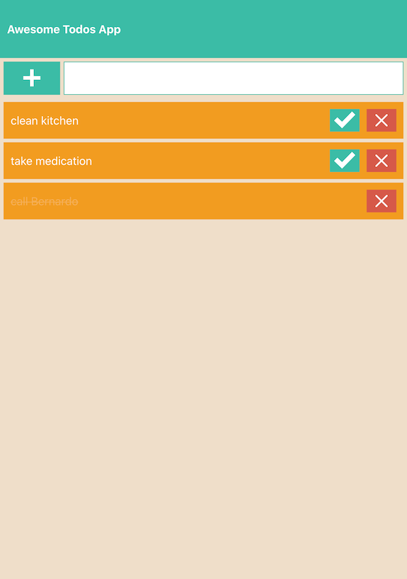

# Awesome-Todos App *WIP!!*

An app develop with a monorepo stratey and bootstrapped using [Lerna](https://github.com/lerna/lerna).

Includes authentication using JWT strategy with a HttpOnly Cookie.

## Screenshot

## Install dependencies

Run `yarn bootstrap` at project root.

## How to run

Run `yarn start` at project root.

## Stack

### Frontend
- [React](https://github.com/facebook/react)
- [React-Query](https://github.com/tannerlinsley/react-query)
- [Axios](https://github.com/axios/axios)
- [CSS Modules](https://github.com/css-modules/css-modules)

### Backend
- [NodeJs](https://github.com/nodejs)
- [ExpressJs](https://github.com/expressjs/express)
- [Mongoose](https://github.com/Automattic/mongoose)
- [jsonwebtoken](https://github.com/auth0/node-jsonwebtoken)
- [bcrypt](https://github.com/kelektiv/node.bcrypt.js)

### Testing
- [Jest](https://github.com/facebook/jest)
- [Testing-Library/react](https://testing-library.com/docs/react-testing-library/intro)

### Other frameworks
- [Typescript](https://github.com/microsoft/TypeScript)
- [Nodemon](https://github.com/remy/nodemon)
- [ESLint](https://github.com/eslint/eslint)
- [Prettier](https://github.com/prettier/prettier)
- [TS-Node](https://github.com/TypeStrong/ts-node)

## TODO
- Forms validations
- Add support for logout
- Tests
- Login: Redirect if JWT valid (head verb?)